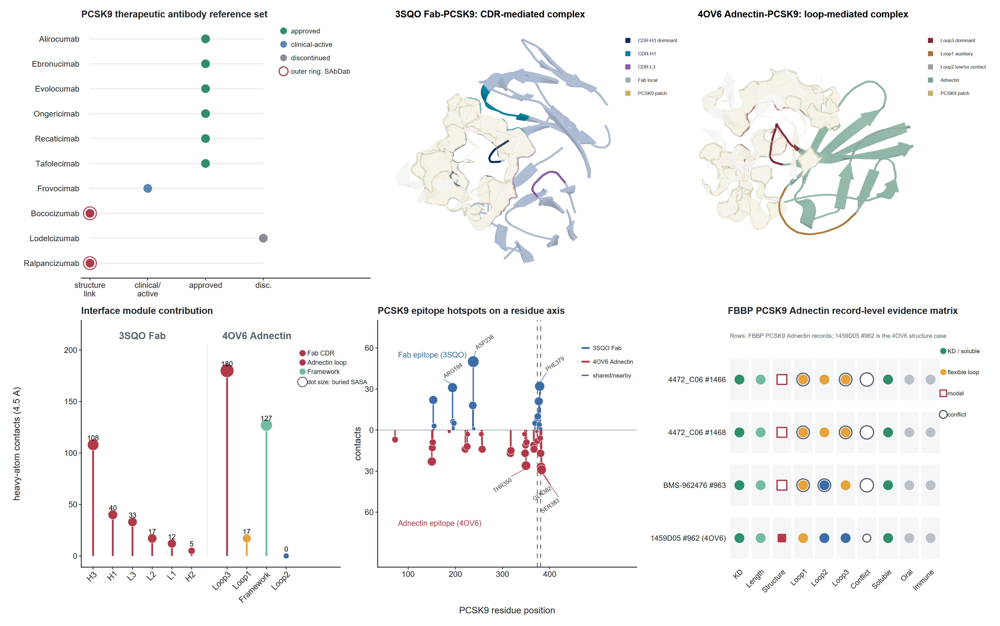

[**English**](./README.md) | [中文](./README_CN.md)

# FBBP Bioinformatics Data and Reproducibility Release

Publication-facing supplementary data, repository files, source-data manifests, schemas, and reproducibility assets for the FBBP project.

**Status:** Submission-oriented public release | **Public release:** 2026-06-10

| Start here | Resource |
|---|---|
| Primary documentation | [Release inventory](./supplementary_data_repository_inventory.csv) |
| Reproducibility / implementation | [Repository files](./Repository_Files_FBBP_DB_v1_release/) |
| Verified outcomes | [Checksums](./checksums_sha256.txt) |

---
Package structure:
- `Supplementary_Data_1_Field_Level_Data_Dictionary`: field-level data dictionary.
- `Supplementary_Data_2_LLM_Prompts_and_Curation_QC`: full LLM prompt archive and sanitized LLM curation-QC metrics.
- `Supplementary_Data_3_RAG_Agent_Benchmark`: fixed 120-question RAG/agent benchmark set and evaluation tables.
- `Supplementary_Data_4_Figure_Source_Data_Code_Manifest`: sanitized figure source-data/code manifest.
- `Repository_Files_FBBP_DB_v1_release`: release tables, schema, analysis outputs, code/scripts and release metadata.

Absolute local filesystem paths were removed from generated public-facing files. Sanitized build provenance is provided without local source paths, and package-level checksums are provided in `checksums_sha256.txt`.

