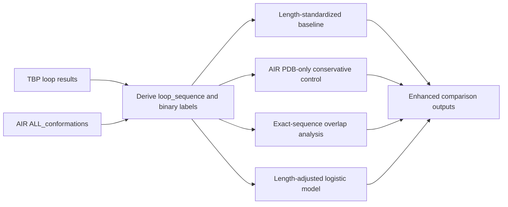
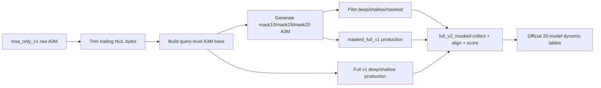

# TBP vs AIRs 对照分析与 masked MSA 详细过程结果说明

## 一、文档目的与当前结论

本文档用于把当前 TBP loop 柔性分析中最关键的两条工作线完整梳理清楚。第一条是 `TBP vs AIRs` 的系统性对照分析，目标是回答 TBP 功能 loop 是否相对于公开参考构象集表现出更高的柔性倾向。第二条是 `masked MSA` 驱动的 whole-loop 动态分析流程，目标是说明为什么当前 official dynamic 结果必须采用 `v2_masked` 而不是旧版 `full_v1`，以及 `mask10 / mask15 / mask20` 三路 masked 分支如何实质改变了 dynamic flexibility 的估计。

当前已经可以给出的总判断有两点。其一，TBP 相对于 AIR 参考集更偏柔，这个结论在长度标准化、PDB-only 保守子集、exact-sequence overlap 检查以及长度校正 logistic 模型下都保持稳定。其二，whole-loop dynamic 分析当前必须以 `20-model masked-inclusive ensemble` 为正式版本；如果忽略 `mask10 / mask15 / mask20`，会系统性低估一部分 loop 的构象多样性、簇复杂度和整体柔性偏向。

## 二、TBP vs AIRs 对照分析

### 2.1 数据来源与口径

TBP 侧的基础输入来自当前正式 loop 结果表 [loop_flexibility_results_long.csv](<local_path_removed>/loop_flexibility_results_long.csv) 以及蛋白级宽表 [main_with_all_results_wide.csv](<local_path_removed>/main_with_all_results_wide.csv)。AIR 侧参考集来自 `ALL_conformations` 解包后的 `ALL_conformations_flexibility.csv`。当前正式的强化版对照脚本是 [compare_tbp_vs_airs_v2.py](<local_path_removed>/compare_tbp_vs_airs_v2.py)，输出包括：

- [tbp_vs_airs_enhanced_loop_level_v2.csv](<local_path_removed>/tbp_vs_airs_enhanced_loop_level_v2.csv)
- [tbp_vs_airs_length_standardized_summary_v2.csv](<local_path_removed>/tbp_vs_airs_length_standardized_summary_v2.csv)
- [tbp_vs_airs_logit_summary_v2.csv](<local_path_removed>/tbp_vs_airs_logit_summary_v2.csv)
- [tbp_vs_airs_exact_match_dynamic_summary_v2.csv](<local_path_removed>/tbp_vs_airs_exact_match_dynamic_summary_v2.csv)
- [tbp_vs_airs_mantel_haenszel_summary_v2.csv](<local_path_removed>/tbp_vs_airs_mantel_haenszel_summary_v2.csv)
- [tbp_vs_airs_enhanced_summary_v2.json](<local_path_removed>/tbp_vs_airs_enhanced_summary_v2.json)
- [tbp_vs_airs_enhanced_analysis_20260402.md](<local_path_removed>/tbp_vs_airs_enhanced_analysis_20260402.md)

TBP 侧的二元柔/刚标签并不是直接沿用 `flexibility_consensus_label`，而是先把 `ITsFlexible` 的 `itsflex_class` 映射为二元标签。也就是说，`high_confidence_flexible` 和 `low_confidence_flexible` 被并入 `flexible`，`high_confidence_rigid` 和 `low_confidence_rigid` 被并入 `rigid`，而 `ambiguous` 与 `NA` 不进入严格二元比较。AIR 侧则直接采用官方 `flexibility_label`。这种设计的目的是让 `TBP vs AIRs` 的顶层对照在标签语义上尽量保持一致，同时避免把 `TBP` 侧的模糊样本强行推入二元比较。

### 2.2 分析流程

强化版 `TBP vs AIRs` 并不是单一一张比例表，而是分三步构建。首先，从 TBP 正式结果表中恢复每个 loop 的序列窗口，即根据 `Final_Tested_Sequence`、`loop_start` 和 `loop_end` 精确截取 `loop_sequence`，随后与 AIR 中的 `seq_loop` 对齐。其次，建立长度标准化框架：并不是直接拿 TBP 与 AIR 的全体柔性比例比较，而是先按 loop length 计算 AIR 的柔性基线，再用 TBP 自身的长度分布对这个基线做加权，从而排除“TBP 更柔只是因为 loop 更长”的解释。最后，再用 logistic 模型把 `dataset_is_tbp` 与 `loop_length`、`loop_length^2` 一起纳入，把长度效应显式调掉，得到一个长度校正后的数据集效应。

这套流程本质上把 `TBP vs AIRs` 从首版的“长度分层描述性比较”推进成了一个更接近 matched-control 的对照体系。它仍然不是 residue-resolution 的逐残基验证，但已经把目前能在 loop-level 上严格对齐的部分尽可能做完整了。

### 2.3 数据规模

在当前正式版本下，TBP 与 AIR 的比较规模如下：

| 指标 | 数值 |
| --- | ---: |
| TBP loop 总数 | 3383 |
| TBP 可做二元柔/刚比较的 loop | 2870 |
| TBP `primary_approved` 可比较 loop | 816 |
| AIR loop 总数 | 21104 |
| AIR `PDB` 子集 loop | 20814 |

TBP 的二元可比较样本之所以少于总 loop 数，是因为 `ITsFlexible` 的 `ambiguous` 和 `NA` 被排除出严格二元对照。这样做会少掉一部分样本，但换来的是更稳定的标签比较。

### 2.4 顶层结果

顶层柔性比例已经显示出非常明显的 TBP 偏柔趋势。TBP 全部二元可比较 loop 中，柔性比例为 `0.76446`；在最核心的 `primary_approved` 子集中，柔性比例进一步升至 `0.79412`。相比之下，AIR 官方全体参考集的柔性比例为 `0.21053`，AIR 的 `PDB-only` 子集柔性比例为 `0.20606`。因此，即便采用更保守的 AIR `PDB-only` 口径，TBP 仍然显著更偏柔。

长度标准化之后，这个结论没有消失。按 TBP 全部二元样本的长度分布去加权，AIR 的期望柔性比例只有 `0.26997`；按 TBP `primary_approved` 子集的长度分布去加权，AIR 的期望柔性比例为 `0.30618`。也就是说，即使强行把 AIR 拉成和 TBP 一样的长度结构，TBP 观测到的柔性比例依然高出约 `0.49`。这已经说明 `TBP > AIR` 的差异不是单纯由 loop 长度构成造成的。

### 2.5 长度校正 logistic 模型

长度校正 logistic 模型把 `dataset_is_tbp` 与 `loop_length`、`loop_length^2` 同时纳入，目的是直接测试“在控制长度之后，来自 TBP 数据集是否仍然更可能被判为 flexible”。结果非常稳定，无论是 `AIR_all` 还是 `AIR_PDB`，无论是 `TBP_all_binary` 还是 `TBP_primary_approved`，`dataset_is_tbp` 的回归系数都为正，对应 odds ratio 均在 `10.6` 到 `11.3` 之间。

| 比较口径 | n_obs | OR | 95% CI | p |
| --- | ---: | ---: | --- | ---: |
| TBP all binary vs AIR all | 23974 | 10.64 | 9.68–11.70 | 0 |
| TBP primary vs AIR all | 21920 | 11.00 | 9.22–13.12 | 0 |
| TBP all binary vs AIR PDB | 23684 | 10.88 | 9.90–11.96 | 0 |
| TBP primary vs AIR PDB | 21630 | 11.30 | 9.47–13.47 | 0 |

从统计解释上看，这意味着在控制 loop 长度曲线之后，TBP loop 仍然比 AIR loop 更有可能落到 `flexible` 类别里，而且效应量非常大。对于论文写作而言，这一层比简单比例差异更有说服力，因为它显式控制了最容易被质疑的协变量。

### 2.6 exact-sequence overlap 分析

强化版分析还额外检查了 TBP 与 AIR 的 exact-sequence overlap。当前正式 `v2` 口径下，`TBP` 中有 `121` 条 loop 与 AIR 的 `seq_loop` 形成严格 exact overlap。需要单独说明的是，早期首版 raw 对照表 [tbp_vs_airs_exact_sequence_matches_v1.csv](<local_path_removed>/tbp_vs_airs_exact_sequence_matches_v1.csv) 中记录过 `257` 条 raw match 行，这个数字对应的是首版 raw exact-match 输出，不应与当前强化版 `v2` 的严格 loop-level overlap 口径直接混用。

当前 `v2` 口径下的 dynamic 对照结果如下：

| 组别 | n_loops | n_with_dynamic | Diversity mean | Dynamic mean | Clusters mean |
| --- | ---: | ---: | ---: | ---: | ---: |
| no exact AIR seq match | 3262 | 3053 | 3.2937 | 1.6612 | 5.2552 |
| exact AIR seq match | 121 | 120 | 2.9442 | 1.5859 | 3.5083 |

这个结果提示，和 AIR 中已知 loop 序列完全重合的 TBP loop，平均 dynamic diversity 和 cluster complexity 反而更低。更合理的解释不是“TBP 与 AIR 更像所以更 rigid”，而是 AIR 里更容易反复收录的是一些短的、保守的、结构数据库更偏好的 loop 模体；而 TBP 中真正高动态、高多稳态的功能 loop，更可能集中在那些并不与 AIR 形成 exact-sequence overlap 的条目里。

### 2.7 当前对照分析能说到哪一步

因此，当前 `TBP vs AIRs` 的结论已经可以比较稳地写成：TBP 功能 loop 在二元柔性标签上显著高于 AIR 参考集，这个差异不由长度分布单独解释，在 `AIR PDB-only` 保守子集和长度校正 logistic 模型下依然成立。但同时也要诚实说明，AIR 侧目前没有与 TBP 完全同构的 `DSSP / GetContact / localcolabfold dynamic` 全套 residue-level 原始指标，因此这仍然是一种 loop-level 的系统对照，而不是逐残基、逐界面的直接验证。

## 三、masked MSA 与 whole-loop 动态流程

### 3.1 背景与基本动机

TBP 的 whole-loop 动态分析最早已经可以在 `deep + shallow` 两路 localcolabfold 采样上运行，但这一版只为每个 Target 提供 `8` 个模型，容易低估一些具有多稳态或边缘构象群的 loop。为了增强构象探索能力，后续流程引入了 `masked MSA` 支线，也就是在查询级 A3M 上人为构造多组遮蔽版本，再让同一 Target 在不同信息约束下独立采样，从而把 dynamic ensemble 从 `8-model` 扩展到 `20-model masked-inclusive ensemble`。

整个 masked 流程并不是简单多跑几次 ColabFold，而是经历了 `MSA 清洗 -> 查询级 A3M 构建 -> masked A3M 生成 -> pilot 验证 -> full_v1 生产 -> masked_full_v1 生产 -> full_v2_masked 系综合并与重评分` 这一整条工程链。

### 3.2 A3M 清洗与查询级 A3M 构建

根据进度记录 [progress.md](<local_path_removed>/progress.md)，在 `2026-03-23` 这条工作线被正式收敛成当前方案时，首先确认远端 `msa_only_v1` 目录内全部 `3150` 个 `.a3m` 文件都带有单个结尾 NUL 字节。随后这些文件在远端被原地清洗，并生成审计清单：

- `<local_path_removed>/a3m_nul_cleanup_manifest_20260323.csv`

清洗之后，所有拆分的 `uniref.a3m` 与 `bfd...a3m` 被合并为查询级 A3M，输出到：

- `<local_path_removed>
- `<local_path_removed>/a3m_base_manifest_20260323.csv`

这一步的意义在于把最早依赖在线 MSA API 的流程转成可复用、可离线重跑的查询级 A3M 工作流，从而后续所有 masked 分支都不再依赖实时网络查询。

### 3.3 masked A3M 生成与第一次失败

masked A3M 不是一上来就成功的。根据同一份进度记录，首次 masked 方案失败的根因是掩蔽逻辑错误地按原始字符串下标进行，而不是按 A3M 对齐列语义进行。这一点很关键，因为 A3M 中的插入和 gap 会让“字符下标”和“对齐列位置”并不等价。如果继续按原始字符串坐标屏蔽，会把实际列对齐关系破坏掉，从而得到表面上看像 A3M、实际上语义错误的输入。

在定位到这一点之后，masked 方案改成按 A3M 对齐列进行掩蔽，smoke test 才通过。随后全量 masked A3M 以断点续跑方式生成到：

- `<local_path_removed>
- `<local_path_removed>/masked_a3m_manifest_20260323.csv`

这一步的意义不只是“多出三组输入”，而是为后续 dynamic 结果提供了三种额外的 MSA 约束视角。相比单纯 deep/shallow 两路，`mask10 / mask15 / mask20` 更容易把某些在原始 MSA 条件下不易显露的替代构象状态释放出来。

### 3.4 pilot 阶段

在全量生产之前，流程先构建了 `12` 条代表性序列的 pilot 批次，并提交了三个 GPU 作业：

- `5116064`
- `5116065`
- `5116066`

这三组作业对应 `deep / shallow / masked` 三路 pilot 采样。随后 pilot 的 `108` 个模型被收集成统一系综，并生成 whole-loop 打分输出：

- `<local_path_removed>/pilot_whole_loop_scores.csv`

按执行记录，pilot 阶段最发散的几个 loop 包括：

- `SEQ_F1C9AFAB1037:A:L2`，`FlexScore_EnsembleDiversity = 42.060`
- `SEQ_F1C9AFAB1037:A:L6`，`33.456`
- `SEQ_F1C9AFAB1037:A:L4`，`33.451`
- `SEQ_06C182B336F4:A:L9`，`27.029`

pilot 的作用不是生成最终统计，而是证明 masked 分支确实能让系综发散度和多样性显著扩展，并且整条 `A3M -> 采样 -> collect -> flexscore` 链条在离线模式下可以打通。

### 3.5 full_v1 深浅两路生产

pilot 打通后，正式生产先提交了 `deep / shallow` 两路的全量 `full_v1` 作业，按序列长度拆成三桶，共 `6` 个 GPU 任务：

- `5116094` short deep
- `5116095` short shallow
- `5116096` medium deep
- `5116097` medium shallow
- `5116098` long deep
- `5116099` long shallow

从当前 `collect_jobs_full_v2_masked.csv` 可以反推出这批 Target 的长度桶分布为：

| bucket | n_sequences |
| --- | ---: |
| short_le150 | 1464 |
| medium_151_500 | 94 |
| long_gt500 | 17 |

总共 `1575` 条序列进入 whole-loop dynamic 采样，平均长度约 `100.69 aa`，中位数 `90 aa`，最长 `1203 aa`。这说明 whole-loop dynamic 主分析的绝大多数条目其实都落在 short bucket，因此后续 masked 分支的主要价值首先会体现在这些短序列 scaffold 上。

旧版 `full_v1` 只包含 `deep + shallow`，因此每个 Target 最终只有 `8` 个模型，输出到 [whole_loop_scores_full_v1.csv](<local_path_removed>/whole_loop_scores_full_v1.csv)。这版结果已经可以支撑第一轮 dynamic 分析，但它并不是当前推荐的正式版本。

### 3.6 masked_full_v1 生产与 full_v2_masked 首轮失真

在 `full_v1` 跑通之后，masked 全量生产被分解成 `mask10 / mask15 / mask20` 与 `short / medium / long` 的笛卡尔积，共 `9` 个作业。按执行记录，这 `9` 个任务都完成了，对应的分支数据落在远端 `masked_full_v1` 目录下。随后才进入 `full_v2_masked` 的 collect 和重评分阶段。

但 `full_v2_masked` 的第一轮结果是“看似完成、实则失真”的。问题不在采样，而在 collect 阶段：远端脚本在收集 masked PDB 时仍然沿用了只适配 `deep / shallow` 的 glob 规则，因此虽然结果目录里存在 `mask10 / mask15 / mask20` 的 PDB，`collect_manifest_full_v2_masked.csv` 却只收进了 `deep` 和 `shallow` 两路。也就是说，首轮 `full_v2_masked` 表面上生成了结果文件，本质上仍然只是旧版 `8-model` 口径。

这个错误后来被正式定位并修复在脚本 [run_remote_whole_loop_full_v2_masked.py](<local_path_removed>/run_remote_whole_loop_full_v2_masked.py) 里。核心修复是把 masked 分支 glob 模式改成：

- `mask10`: `.mask10.rep*_unrelaxed_rank_*.pdb`
- `mask15`: `.mask15.rep*_unrelaxed_rank_*.pdb`
- `mask20`: `.mask20.rep*_unrelaxed_rank_*.pdb`

修复后重新远端 collect 和打分，才得到当前真正的 `20-model` 正式结果。

### 3.7 full_v2_masked 最终结构

当前正式 `v2_masked` 结果回收到本地后，collect manifest 已显示五路分支完整纳入：

| branch | n_models |
| --- | ---: |
| deep | 6300 |
| shallow | 6300 |
| mask10 | 6300 |
| mask15 | 6300 |
| mask20 | 6300 |

总 collected PDB 数为 `31500`，对应 `1575` 个 Target，每个 Target `20` 个模型。整个 collect 与评分链当前的关键文件包括：

- [collect_jobs_full_v2_masked.csv](<local_path_removed>/collect_jobs_full_v2_masked.csv)
- [collect_manifest_full_v2_masked.csv](<local_path_removed>/collect_manifest_full_v2_masked.csv)
- [whole_loop_scores_full_v2_masked.csv](<local_path_removed>/whole_loop_scores_full_v2_masked.csv)

当前 whole-loop dynamic 覆盖如下：

| cohort | total | dynamic non-null |
| --- | ---: | ---: |
| primary_approved_v1 | 901 | 886 |
| secondary_active_standard_v1 | 2400 | 2287 |
| all_active_trace_v1 | 82 | 0 |

因此，当前正式 dynamic 分数一共覆盖 `3173 / 3383` 条 loop。这里的缺口主要集中在 trace 层与无法稳定进入 whole-loop dynamic 流程的条目，而不是主分析层的大面积缺失。

### 3.8 v1 与 v2_masked 的核心差异

从 [whole_loop_scores_full_v1.csv](<local_path_removed>/whole_loop_scores_full_v1.csv) 与 [whole_loop_scores_full_v2_masked.csv](<local_path_removed>/whole_loop_scores_full_v2_masked.csv) 的逐条对比来看，`masked` 的引入绝不是微调，而是系统性重写了 dynamic flexibility 的估计。

| 指标 | v1 | v2_masked |
| --- | ---: | ---: |
| scored loops | 3173 | 3173 |
| Diversity mean | 2.9003 | 3.2805 |
| Diversity median | 0.840 | 1.089 |
| IntraCluster mean | 0.3574 | 0.4292 |
| InterCluster mean | 3.1475 | 3.5927 |
| Num_Clusters mean | 2.5717 | 5.1891 |
| Num_Clusters median | 1 | 2 |

发生变化的 loop 数量如下：

| 项目 | changed loops |
| --- | ---: |
| `FlexScore_EnsembleDiversity` | 3169 |
| `FlexScore_IntraCluster` | 2828 |
| `FlexScore_InterCluster` | 1902 |
| `Num_Clusters` | 1644 |

这说明 `mask10 / 15 / 20` 的并入并没有提升覆盖率，但实质性提高了已覆盖 loop 的 dynamic 估计敏感度。尤其是 `Num_Clusters` 从均值 `2.57` 升到 `5.19`，表明许多旧版在 `8-model` 下看似接近单簇或低复杂度的 loop，在 `20-model` 口径下被重新识别为多稳态系统。

### 3.9 代表性变化最大的 loop

动态多样性上升最明显的条目包括：

| loop_id | Diversity old | Diversity new | Clusters old | Clusters new |
| --- | ---: | ---: | ---: | ---: |
| `SEQ_764CCD541B59:A:L6` | 7.823 | 23.064 | 8 | 20 |
| `SEQ_2C4CD2219498:A:L4` | 0.796 | 11.158 | 1 | 9 |
| `SEQ_A72091D532A5:A:L5` | 22.105 | 32.428 | 8 | 20 |
| `SEQ_2C4CD2219498:A:L1` | 0.771 | 10.709 | 1 | 7 |
| `SEQ_8C3CB6C16CEF:A:L6` | 19.864 | 29.459 | 8 | 20 |

动态多样性下降最明显的条目包括：

| loop_id | Diversity old | Diversity new | Clusters old | Clusters new |
| --- | ---: | ---: | ---: | ---: |
| `SEQ_40364A764F6D:A:L2` | 30.872 | 22.314 | 8 | 20 |
| `SEQ_40364A764F6D:A:L5` | 27.078 | 19.844 | 8 | 20 |
| `SEQ_3C4A760A450C:A:L5` | 25.109 | 18.413 | 8 | 20 |
| `SEQ_5C795AB24C01:A:L6` | 25.175 | 18.496 | 8 | 20 |
| `SEQ_5C795AB24C01:A:L4` | 22.982 | 17.036 | 8 | 20 |

这些下降并不表示结果变差。更合理的解释是，在 `20-model` 采样下，原先由少量极端构象放大的离散度被重新平均化，从而得到更稳、更不受单轮采样偶然性影响的 dynamic 估计。

### 3.10 合并到最终总表后的影响

`v2_masked` 并不是停留在单个 CSV，而是已经写回正式总表。当前 official 结果表为：

- [loop_flexibility_results_long.csv](<local_path_removed>/loop_flexibility_results_long.csv)
- [protein_flexibility_summary.csv](<local_path_removed>/protein_flexibility_summary.csv)
- [protein_main_clean_with_flexibility.csv](<local_path_removed>/protein_main_clean_with_flexibility.csv)
- [main_with_all_results_wide_with_flexibility.csv](<local_path_removed>/main_with_all_results_wide_with_flexibility.csv)

在最终 loop 总表层面，`flexibility_consensus_label` 的分布已从旧版的 `2228 / 933 / 172`（flexible / intermediate / rigid）变成新版的 `2497 / 711 / 125`。因此，masked 分支引入后，TBP loop 集合整体更偏向被解释为 flexible 或多稳态，而不是把大量边缘动态样本压缩在 intermediate 或 rigid 一侧。蛋白级 `flexibility_dynamic_score_mean` 的平均值也已提升到 `1.6700`，说明 masked 带来的动态增强不是少数极端个例，而是贯穿整个蛋白集合的系统趋势。

### 3.11 masked MSA 的详细分析结果

如果把 `masked MSA` 这条线单独当作结果来读，它最核心的贡献可以概括成四点。第一，它没有改变 whole-loop dynamic 的覆盖对象，而是改变了同一批 loop 的动态估计值。当前 `3383` 条 loop 中，仍然只有 `3173` 条进入了正式 dynamic 评分，但这 `3173` 条的分数结构已经被明显改写。第二，它显著提升了多簇结构的检出能力。旧版 `v1` 中 `Num_Clusters` 的中位数只有 `1`，说明大量 loop 在 `8-model` 采样下会被看成单簇；而 `v2_masked` 中位数已上升到 `2`，均值更是从 `2.57` 增加到 `5.19`，这表明很多 loop 在增加 masked 采样后被重新识别为多稳态系统。第三，它系统性提高了构象多样性和动态综合分，而不仅仅是零星影响若干极端样本。第四，它对综合柔性标签的影响具有明确方向性，即整体把更多 loop 从 `intermediate` 推向 `flexible`。

从 cohort 分层来看，`v2_masked` 对主分析层的影响是普遍存在的，而不是只集中在某个子集。`primary_approved_v1` 中共有 `901` 条 loop，其中 `886` 条具有正式 dynamic 分数，`FlexScore_EnsembleDiversity` 均值为 `3.053`，`Num_Clusters` 均值为 `5.328`，`flexibility_score_dynamic` 均值为 `1.613`。`secondary_active_standard_v1` 中共有 `2400` 条 loop，其中 `2287` 条具有 dynamic 分数，`FlexScore_EnsembleDiversity` 均值为 `3.369`，`Num_Clusters` 均值为 `5.135`，`flexibility_score_dynamic` 均值为 `1.675`。这说明 masked 采样带来的多稳态增强不是某个单独 cohort 的偶发现象，而是在 primary 和 secondary 两层都成立。

综合柔性标签的迁移矩阵进一步说明，这种变化不是随机噪声。旧版 `flexible / intermediate / rigid` 的分布为 `2228 / 933 / 172`，新版变为 `2497 / 711 / 125`。如果按旧版标签向新版标签的迁移关系拆开看，最主要的转移是 `intermediate -> flexible`，共有 `292` 条，其次是 `rigid -> intermediate` `36` 条，以及 `rigid -> flexible` `14` 条；反方向变化相对少得多，仅有 `37` 条 `flexible -> intermediate`，以及 `3` 条 `intermediate -> rigid`。这种不对称迁移模式非常重要，因为它说明 masked 分支引入后，dynamic 流程整体是在“释放被低估的柔性和多稳态”，而不是简单让结果上下随机波动。

如果只看 dynamic 原始指标，`masked MSA` 最直观的效果体现在 `FlexScore_EnsembleDiversity`、`FlexScore_IntraCluster` 和 `FlexScore_InterCluster` 三条曲线上。`FlexScore_EnsembleDiversity` 的均值从 `2.9003` 升到 `3.2805`，中位数从 `0.840` 升到 `1.089`；`FlexScore_IntraCluster` 均值从 `0.3574` 升到 `0.4292`；`FlexScore_InterCluster` 均值从 `3.1475` 升到 `3.5927`。因此，masked 不仅增加了“是否多簇”的判断概率，也提高了簇内扩散与簇间分离的综合估计。换句话说，它同时增强了“局部松动”和“全局构象分化”的检出能力。

需要强调的是，`masked MSA` 不是简单让所有分数都变大。某些 loop 的 dynamic diversity 在新版中反而下降，例如 `SEQ_40364A764F6D:A:L2`、`SEQ_40364A764F6D:A:L5`、`SEQ_3C4A760A450C:A:L5` 和 `SEQ_5C795AB24C01:A:L6` 等。这种下降的统计学意义并不是“masked 失败了”，而更像是随着采样数量增加，原先被少量极端构象放大的 diversity 被重新平衡，最终得到更稳定、更接近真实构象分布的估计。因此，`masked MSA` 的价值不应只理解为“让分数升高”，而应理解为“让 dynamic 结果更充分、更稳、更接近多稳态系统的真实采样结果”。

### 3.12 masked MSA 的结论

如果把 `masked MSA` 这条线单独总结为结果结论，可以写成如下几句。第一，`masked MSA` 不是可有可无的附加优化，而是 whole-loop dynamic 工作流中会实质改变结果分布的核心步骤；忽略 `mask10 / mask15 / mask20` 会系统性低估一部分 loop 的构象多样性和簇复杂度。第二，`20-model masked-inclusive ensemble` 相比旧版 `8-model deep+shallow ensemble`，更容易把 TBP loop 解释为多稳态、柔性和可探索，而不是把大量边缘动态样本压缩为单簇或低多样性状态。第三，`masked MSA` 带来的结果增强在 primary 与 secondary 两层都成立，并最终推动综合柔性标签整体向 `flexible` 一侧迁移。第四，这种升级并没有破坏 `TBP vs AIRs` 的顶层差异，反而使 TBP “偏柔”的结论拥有了更强的 dynamic 支撑。

## 四、TBP vs AIRs 与 masked MSA 之间的关系

这两条线不是彼此独立的。`TBP vs AIRs` 的顶层柔/刚比较主要建立在 `ITsFlexible` 标签和 AIR 官方柔/刚标签之上，因此 `masked MSA` 的引入不会把 AIR 对照的 top-line 结论从根本上推翻。相反，它起到的是“补充 dynamic 证据链”的作用：即便在 `20-model masked-inclusive ensemble` 下，TBP 整体更偏柔的结论依旧成立，这恰恰说明 TBP 的偏柔不是某个动态参数设置造成的假阳性，而是静态指标、知识驱动柔性标签和 dynamic 多稳态估计共同支持的稳健现象。

另一方面，`exact-sequence overlap` 的 dynamic 结果又提示，与 AIR 已知 loop 序列重合的 TBP loop 并不是 TBP 高动态性的主要来源。这一点对后续研究策略非常重要。它意味着 TBP 的创新性和高动态性，未必来自“重复 AIR 里已经常见的那类 loop 模体”，而更可能来自那些在 AIR 中没有直接 exact overlap 的功能 loop。换句话说，TBP 的设计空间在 dynamic 维度上并没有被 AIR 参考集充分覆盖。

## 五、当前推荐采用的正式版本

截至目前，建议把以下文件作为当前正式结果口径：

- `TBP vs AIRs` 对照正式分析：  
  [tbp_vs_airs_enhanced_analysis_20260402.md](<local_path_removed>/tbp_vs_airs_enhanced_analysis_20260402.md)
- whole-loop dynamic 正式更新说明：  
  [v2_masked结果更新说明_20260402.md](<local_path_removed>/v2_masked结果更新说明_20260402.md)
- 当前汇总性 loop 结果表：  
  [loop_flexibility_results_long.csv](<local_path_removed>/loop_flexibility_results_long.csv)
- 当前蛋白级汇总表：  
  [protein_flexibility_summary.csv](<local_path_removed>/protein_flexibility_summary.csv)

如果在论文或阶段性报告中需要一句最凝练的结论，可以写成如下形式：当前 `TBP` 功能 loop 相对于 `AIR` 参考集表现出稳定且显著更高的柔性倾向，这一差异在长度标准化、PDB-only 对照和长度校正模型下均保持成立；同时，whole-loop dynamic 分析已经升级为 `20-model masked-inclusive ensemble`，相较旧版 `8-model deep+shallow ensemble` 更充分地揭示了 TBP loop 的构象多样性、多簇结构与整体柔性偏向。
